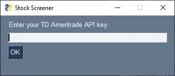
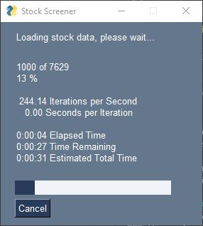
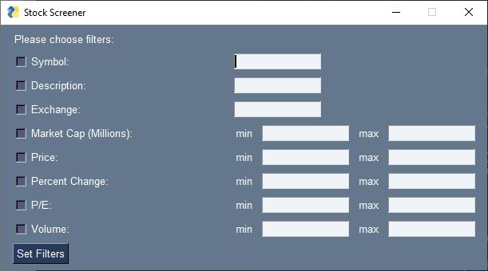
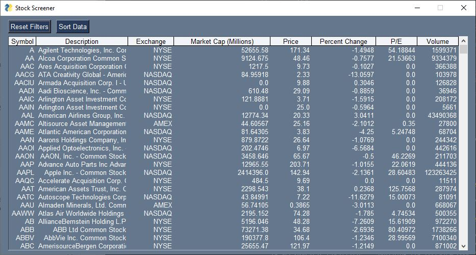
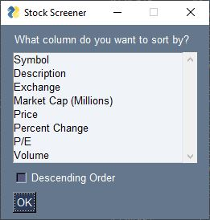

# StockScreener

A stock screener for NASDAQ, NYSE, and AMEX exchanges. Stock data is pulled from the [TD Ameritrade APIs](https://developer.tdameritrade.com/apis), and tickers are gathered using [get-all-tickers](https://github.com/shilewenuw/get_all_tickers). The GUI is written using [PySimpleGUI](https://pysimplegui.readthedocs.io/en/latest/). 

*Note that data is delayed

## How to Use: Running the Program
To run the program either open the .exe file or run the StockScreenerGUI python file. If running the .py file, you will need to have python and the following modules installed:
* [pandas](https://pypi.org/project/pandas/)
* [requests](https://pypi.org/project/requests/)
* [PySimpleGUI](https://pypi.org/project/PySimpleGUI/)
* [get-all-tickers](https://pypi.org/project/get-all-tickers/)*

*Note: The `get-all-tickers` module is currently broken. If running the .py program, you will need to replace the get_tickers.py file in this package with the .py version of the .txt file provided in the repository

## How to Use: Logging In
To use the application you must use your own TD Ameritrade API key. For help getting one, see [here](https://www.youtube.com/watch?v=gaxjxVqUb_A) (video) or [here](https://developer.tdameritrade.com/content/getting-started). If the API key you entered is invalid, you will get an error message. Otherwise, the program will start loading stock data and you will be taken to the screener. 

# How to Use: Making a Query
After stock data has been loaded, you will be taken to a query screen:

Here you can select what filters you want to screen for. You can select multiple filters.

String filters (like Symbol and Exchange) will return all data matching the filter. For example searching for a symbol, "AB", will return all stocks whose symbol contains the string "AB". Case is ignored.

Numerical filters (like Price and Volume) will return all data between the min and max values (inclusive).  For example, if you wanted to screen for stocks with a price of at least $10, you would select the Price filter and enter 10 in the min box. 

## How to Use: Results Viewer

Once a query is made, the results will be displayed in a table format:

Here you can view your results from the query. To make a new query, select 'Reset Filters', and it will take to you a new query screen. To sort the data, select 'Sort Data', and you can choose which column to sort by, and whether to sort by ascending or descending values. 

