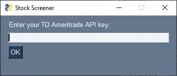

# StockScreener

A stock screener for NASDAQ, NYSE, and AMEX exchanges. Stock data is pulled from the [TD Ameritrade APIs](https://developer.tdameritrade.com/apis), and GUI is written using [PySimpleGUI](https://pysimplegui.readthedocs.io/en/latest/). 

## How to Use: Logging In
To run the program either open the .exe or run the StockScreenerGUI.py file (Note, you will need to have the appropriate packages installed). To use the application you must use your own TD Ameritrade API key. For help getting one, see [here](https://www.youtube.com/watch?v=gaxjxVqUb_A) (video) or [here](https://developer.tdameritrade.com/content/getting-started). If the API key you entered is invalid, you will get an error message. Otherwise, you will be taken to the screener. 

## How to Use: Making a Query

https://github.com/shilewenuw/get_all_tickers